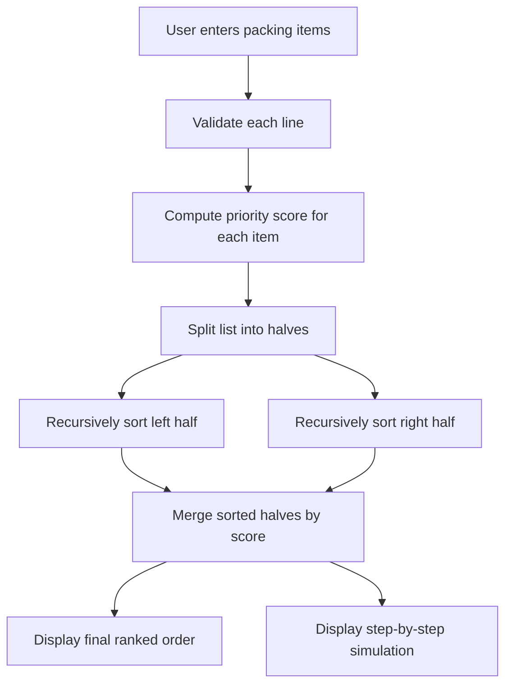
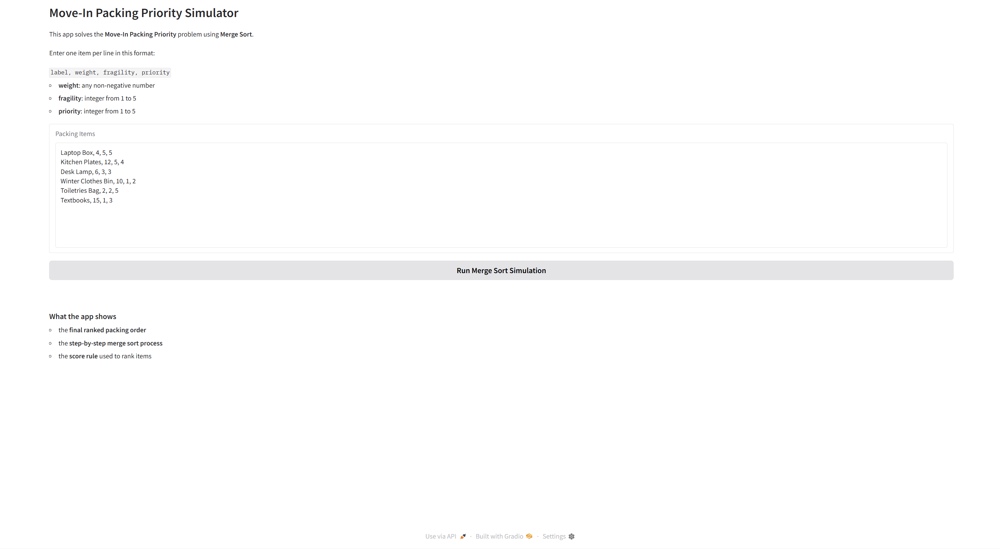
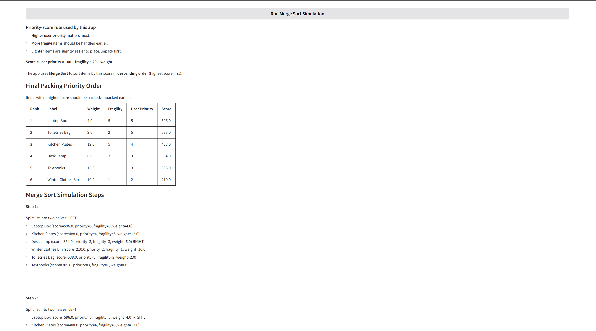
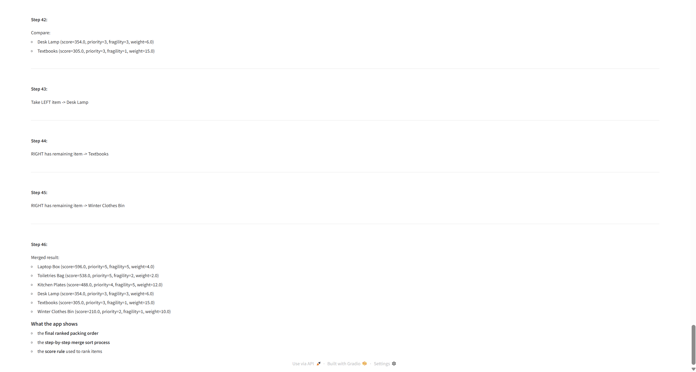

# Move-In Packing Priority Simulator

## Chosen Problem
This project solves the **Move In Packing Priority** problem. A student may have an abundance of times to move into a dorm, apartment, or house. The app helps decide which items should be moved in first by sorting them by priority.

## Chosen Algorithm
This project uses **Merge Sort**.

### Why Merge Sort?
Merge Sort is a good fit because:
- it works well on lists of records, not just plain numbers
- it has a clear divide and conquer structure that is easy to visualize
- its repeated split -> sort -> merge pattern makes the algorithm steps easier
- it produces a predictable step by step simulation for the user

The app sorts items by a single **priority score** in descending order.

### Priority Score Rule
To compare items, I created a score:

**score = user priority × 100 + fragility × 20 − weight**

This means that:
- higher user priority matters the most
- more fragile items should be handled earlier
- lighter items are slightly easier to place or unpack first

The app sorts items from highest score to lowest.

## Problem Breakdown & Computational Thinking

### Decomposition
I broke the problem into parts:
- reading and validating input
- calculating scores
- sorting items using merge sort
- displaying results

### Pattern Recognition
Each item follows the same structure:
- label, weight, fragility, priority

### Abstraction
I simplified each item into a single score so it can be sorted easily.

Instead, it shows only the details that help the user understand the process:
- which list is being split
- which two items are being compared
- which side is chosen during merging
- what the merged result looks like after each step

### Algorithm Design
I used merge sort to:
- split the list into smaller lists
- sort each part
- merge them back together in order

### Flowchart

## Testing

I tested the app with different inputs:

- normal input with several items
- empty input
- invalid values (like fragility outside 1–5)
- items with the same priority
- very heavy vs very light items

This helped make sure the sorting and scoring worked correctly.

Edge Cases:

- each input line must contain exactly 4 values:
- label, weight, fragility, priority
- weight must be a non-negative number
- fragility must be an integer from 1 to 5
- priority must be an integer from 1 to 5
- the app checks these rules and gives a clear error message if the input is invalid

## Steps to Run

1. Install requirements:
   pip install -r requirements.txt

2. Run the app:
   python app.py

## Demo

## Hugging Face Link

https://huggingface.co/spaces/25nt16/move-in-packing-priority

## Author & Acknowledgement

Author: Max Noble

I used AI tools for help with overall structure, code, debugging, and understanding. I reviewed the code, made changes, and fully understand the project.
