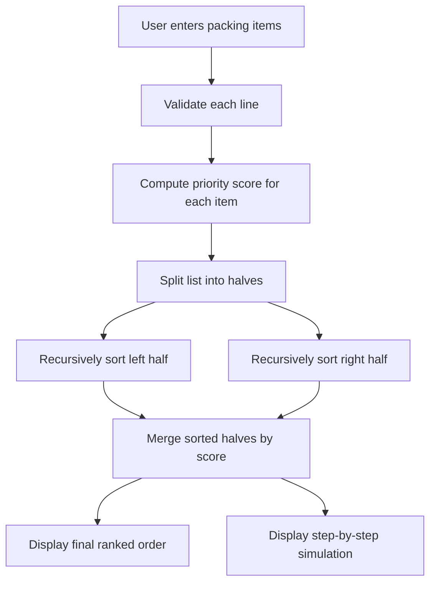

# Move-In Packing Priority Simulator

## Chosen Problem
This project solves the **Move In Packing Priority** problem. A student may have an abundance of times to move into a dorm, apartment, or house. The app helps decide which items should be moved in first by sorting them by priority.

## Chosen Algorithm
This project uses **Merge Sort**.

### Why Merge Sort?
Merge Sort is a good fit because:
- it works well on lists of records, not just plain numbers
- it has a clear divide and conquer structure that is easy to visualize
- its repeated **split -> sort -> merge** pattern makes the algorithm steps easy for a beginner to follow
- it produces a predictable step-by-step simulation for the user

The app sorts items by a single **priority score** in descending order.

### Priority Score Rule
To turn the packing problem into one sortable value, this project uses:

**score = user priority × 100 + fragility × 20 − weight**

This means that:
- higher user priority matters the most
- more fragile items should be handled earlier
- lighter items are slightly easier to place or unpack first

A higher score means the item should appear earlier in the final order.

## Demo
Add a screenshot, gif, or short video here after you run the app locally or on Hugging Face.

## Problem Breakdown & Computational Thinking

### Decomposition
The problem is broken into smaller parts:
- read user input from the Gradio textbox
- split the input into item records
- validate each line and each field
- compute a priority score for every item
- run Merge Sort on the list of items
- record each split, comparison, and merge step
- show the final ranked list and simulation steps in the GUI

### Pattern Recognition
The repeated patterns in this project are:
- repeatedly splitting the list into smaller halves
- repeatedly comparing the first items from two sorted halves
- repeatedly taking the larger-score item first
- repeatedly merging sublists back together

### Abstraction
The app does **not** show low-level Python details like indexes and memory management.

Instead, it shows only the details that help the user understand the process:
- which list is being split
- which two items are being compared
- which side is chosen during merging
- what the merged result looks like after each step

### Algorithm Design
Input -> Processing -> Output:
- **Input:** the user enters item lines in the form `label, weight, fragility, priority`
- **Processing:** the app validates the data, computes a score for each item, then applies Merge Sort
- **Output:** the app displays the final ranked order and a step-by-step merge sort simulation

### Flowchart


## Preconditions and Assumptions
- each input line must contain exactly 4 values:
  `label, weight, fragility, priority`
- weight must be a non-negative number
- fragility must be an integer from 1 to 5
- priority must be an integer from 1 to 5
- the app checks these rules and gives a clear error message if the input is invalid

## What the User Sees During the Simulation
The user sees:
- each time the list is split into left and right halves
- each comparison between two items during merging
- which item is chosen from the left or right half
- the merged result after each merge

## Steps to Run

### Local
1. Install Python 
2. Open a terminal in the project folder.
3. Install dependencies:
   ```bash
   pip install -r requirements.txt
   ```
4. Run the app:
   ```bash
   python app.py
   ```
5. Open the local Gradio link shown in the terminal.

### Files included
- `app.py` - main Gradio application
- `requirements.txt` - required Python packages
- `README.md` - project documentation

## requirements.txt
This project uses:
- gradio

## Hugging Face Link


## Testing

### Typical test
Input:
```text
Laptop Box, 4, 5, 5
Kitchen Plates, 12, 5, 4
Desk Lamp, 6, 3, 3
Winter Clothes Bin, 10, 1, 2
Toiletries Bag, 2, 2, 5
Textbooks, 15, 1, 3
```

Expected behavior:
- the app computes a score for each item
- the app sorts by score from highest to lowest
- the app shows all split and merge steps
- the final ranking should put high-priority and fragile items near the top

### Edge cases tested
1. **Empty input**
   - expected: error message telling the user to enter at least one item

2. **Wrong number of fields**
   - example: `Laptop Box, 4, 5`
   - expected: error message explaining the required format

3. **Negative weight**
   - example: `Mirror, -3, 5, 4`
   - expected: error message because weight cannot be negative

4. **Fragility outside 1-5**
   - example: `Mug, 2, 8, 4`
   - expected: error message

5. **Priority outside 1-5**
   - example: `Notebook, 1, 2, 9`
   - expected: error message

6. **Single item**
   - expected: the app should handle the base case correctly

7. **Duplicate scores**
   - expected: the app should still return a correct sorted list

Add screenshots of at least one successful run and one invalid-input test.

## Deployment Guide

### GitHub
1. Create a new repository on GitHub.
2. Upload:
   - `app.py`
   - `requirements.txt`
   - `README.md`
   - screenshots folder if you have screenshots
3. Commit and push the files.

### Hugging Face Spaces
1. Create a Hugging Face account.
2. Click **New Space**.
3. Choose:
   - **SDK:** Gradio
   - **Visibility:** Public
4. Upload:
   - `app.py`
   - `requirements.txt`
5. Wait for the build to finish.
6. Copy the public Space link into this README and your OnQ submission.

## Author & Acknowledgment
Author: Max Noble

AI use acknowledgment:
This project was created with AI assistance permitted under the course policy. The student reviewed, understood, and submitted the final work.

Sources:
- Course project guidelines
- Gradio documentation
- Hugging Face Spaces documentation
